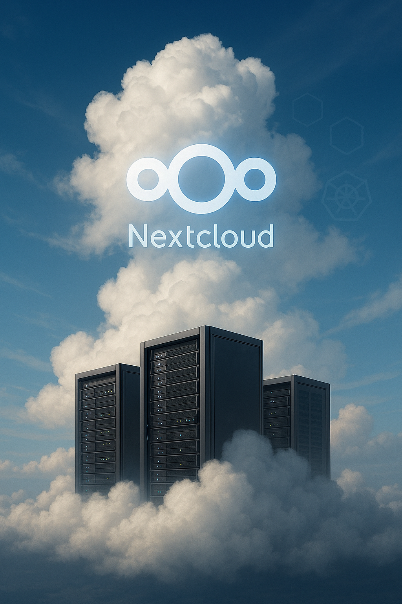

# Semesterarbeit: End-to-End CI/CD-Pipeline mit Terraform, Helm und GH Actions für Nextcloud auf Kubernetes (AWS EKS)



**Student:** Nenad Stevic<br>
**TBZ Lehrgang dipl. Informatiker/in HF - 3. Semester**<br>
**Abgabedatum:** 09.07.2025

# Inhaltsverzeichnis

- [1. Einleitung](#1-einleitung)
    - [1.1 Problemstellung](#11-problemstellung)
    - [1.2 Projektziele](#12-projektziele)
    - [1.3 Vorgehensweise](#13-vorgehensweise)
    - [1.4 Zusammenfassung](#14-zusammenfassung)
    - [1.5 Scope](#15-scope)
- [2. Projektmanagement](#2-projektmanagement)
    - [2.1 Scrum](#21-scrum)
        - [2.1.1 Rollen](#211-rollen)
        - [2.1.2 Artefakte](#212-artefakte)
        - [2.1.3 Zeremonien](#213-zeremonien)
        - [2.1.4 Definition of Done (DoD)](#214-definition-of-done-dod)
        - [2.1.5 Definition of Ready (DoR)](#215-definition-of-ready-dor)
    - [2.2 Projektplanung](#22-projektplanung)
        - [2.2.1 Der Grobplan](#221-der-grobplan)
        - [2.2.2 Strukturierung](#222-strukturierung)
        - [2.2.3 Von Epics zu Sprints: Die iterative Feinplanung](#223-von-epics-zu-sprints-die-iterative-feinplanung)
    - [2.3 Sprint-Durchführung und Dokumentation](#23-sprint-durchführung-und-dokumentation)
    - [2.4 Risiken](#24-risiken)
    - [2.5 Stakeholder und Kommunikation](#25-stakeholder-und-kommunikation)
- [3. Evaluation](#3-evaluation)
    - [3.1 Evaluation von Lösungen](#31-evaluation-von-lösungen)
        - [3.1.1 Cloud Provider (AWS)](#311-cloud-provider-aws)
        - [3.1.2 Container Orchestrierung (Kubernetes - EKS)](#312-container-orchestrierung-kubernetes---eks)
        - [3.1.3 Infrastructure as Code (Terraform)](#313-infrastructure-as-code-terraform)
        - [3.1.4 Application Configuration Management (Helm)](#314-application-configuration-management-helm)
        - [3.1.5 CI/CD Werkzeug (GitHub Actions)](#315-cicd-werkzeug-github-actions)
    - [3.2 Theoretische Grundlagen](#32-theoretische-grundlagen)
        - [3.2.1 Infrastructure as Code (IaC) - Prinzipien](#321-infrastructure-as-code-iac---prinzipien)
        - [3.2.2 CI/CD - Konzepte und Phasen](#322-cicd---konzepte-und-phasen)
        - [3.2.3 Kubernetes - Kernkomponenten](#323-kubernetes---kernkomponenten)
        - [3.2.4 Helm - Charts, Releases, Templates](#324-helm---charts-releases-templates)
        - [3.2.5 Nextcloud auf Kubernetes - Architekturüberlegungen](#325-nextcloud-auf-kubernetes---architekturüberlegungen)
    - [3.3 System-Design / Architektur](#33-system-design--architektur)
        - [3.3.1 Logische Gesamtarchitektur](#331-logische-gesamtarchitektur)
        - [3.3.2 AWS Netzwerkarchitektur (VPC Detail)](#332-aws-netzwerkarchitektur-vpc-detail)
        - [3.3.3 Komponenten und Datenflüsse](#333-komponenten-und-datenflüsse)
- [4. Implementierung und Technische Umsetzung](#4-implementierung-und-technische-umsetzung)
    - [4.1 Infrastruktur-Provisionierung mit Terraform](#41-infrastruktur-provisionierung-mit-terraform)
        - [4.1.1 Terraform Code-Struktur und Module](#411-terraform-code-struktur-und-module)
        - [4.1.2 Provisionierung des Netzwerks (VPC)](#412-provisionierung-des-netzwerks-vpc)
        - [4.1.3 Provisionierung des EKS Clusters und der ECR](#413-provisionierung-des-eks-clusters-und-der-ecr)
        - [4.1.4 Provisionierung der RDS Datenbank und IAM-Rollen](#414-provisionierung-der-rds-datenbank-und-iam-rollen)
        - [4.1.5 Secrets Management für Terraform](#415-secrets-management-für-terraform)
    - [4.2 Nextcloud Helm Chart Entwicklung](#42-nextcloud-helm-chart-entwicklung)
        - [4.2.1 Helm Chart Struktur](#421-helm-chart-struktur)
        - [4.2.2 Wichtige Templates](#422-wichtige-templates)
        - [4.2.3 Konfigurationsmöglichkeiten über `values.yaml`](#423-konfigurationsmöglichkeiten-über-valuesyaml)
    - [4.3 CI/CD Pipeline mit GitHub Actions](#43-cicd-pipeline-mit-github-actions)
        - [4.3.1 Workflow-Definition](#431-workflow-definition)
        - [4.3.2 Authentifizierung gegenüber AWS (OIDC)](#432-authentifizierung-gegenüber-aws-oidc)
        - [4.3.3 Integrationsschritte (Terraform, Helm)](#433-integrationsschritte-terraform-helm)
        - [4.3.4 Secrets Management in der Pipeline](#434-secrets-management-in-der-pipeline)
    - [4.4 Installation und Inbetriebnahme der Gesamtlösung](#44-installation-und-inbetriebnahme-der-gesamtlösung)
        - [4.4.1 Voraussetzungen](#441-voraussetzungen)
        - [4.4.2 Klonen des Repositorys](#442-klonen-des-repositorys)
        - [4.4.3 Konfiguration von Umgebungsvariablen/Secrets](#443-konfiguration-von-umgebungsvariablensecrets)
        - [4.4.4 Ausführen der Pipeline / Manuelle Schritte](#444-ausführen-der-pipeline--manuelle-schritte)
        - [4.4.5 Zugriff auf die Nextcloud Instanz](#445-zugriff-auf-die-nextcloud-instanz)
    - [4.5 Anpassung von Software / Konfiguration von Geräten](#45-anpassung-von-software--konfiguration-von-geräten)
        - [4.5.1 Nextcloud-spezifische Konfigurationen (via Helm)](#451-nextcloud-spezifische-konfigurationen-via-helm)
        - [4.5.2 Wichtige AWS Service-Konfigurationen](#452-wichtige-aws-service-konfigurationen)
- [5. Testing und Qualitätssicherung](#5-testing-und-qualitätssicherung)
    - [5.1 Teststrategie](#51-teststrategie)
        - [5.1.1 Statische Code-Analyse (Linting)](#511-statische-code-analyse-linting)
        - [5.1.2 Validierung der Infrastruktur-Konfiguration](#512-validierung-der-infrastruktur-konfiguration)
        - [5.1.3 Manuelle Funktionstests der Nextcloud Instanz](#513-manuelle-funktionstests-der-nextcloud-instanz)
        - [5.1.4 End-to-End Tests der CI/CD Pipeline](#514-end-to-end-tests-der-cicd-pipeline)
    - [5.2 Testfälle und Protokolle](#52-testfälle-und-protokolle)
        - [5.2.1 Nachweise der Testergebnisse](#521-nachweise-der-testergebnisse)
- [6. Projektdokumentation (Zusammenfassung)](#6-projektdokumentation-zusammenfassung)
    - [6.1 Verzeichnisse und Zusammenfassungen](#61-verzeichnisse-und-zusammenfassungen)
    - [6.2 Quellenangaben und verwendete Werkzeuge](#62-quellenangaben-und-verwendete-werkzeuge)
- [7. Reflexion und Erkenntnisse](#7-reflexion-und-erkenntnisse)
    - [7.1 Abgleich von Theorie und Praxis](#71-abgleich-von-theorie-und-praxis)
    - [7.2 Eigene Erfahrungen und persönlicher Lernprozess](#72-eigene-erfahrungen-und-persönlicher-lernprozess)
    - [7.3 Bewertung der eigenen Lösung und Verbesserungspotenzial](#73-bewertung-der-eigenen-lösung-und-verbesserungspotenzial)
    - [7.4 Handlungsempfehlungen für das weitere Vorgehen](#74-handlungsempfehlungen-für-das-weitere-vorgehen)
- [8. Anhänge](#8-anhänge)
    - [8.1 Verwendete Scrum-Vorlagen (Templates)](#81-verwendete-scrum-vorlagen-templates)
    - [8.2 Weitere Referenzen](#82-weitere-referenzen)
    - [8.3 Link zum GitHub Repository](#83-link-zum-github-repository)
    - [8.4 Link zum GitHub Project Board](#84-link-zum-github-project-board)

---

## 1. Einleitung

*In diesem Kapitel wird das Projekt, die Kriterien und die Vorgehensweise genauer unter die Lupe genommen. Damit wird
ein Überblick über die geplante Arbeit geschaffen, was die Auswertung der Ergebnisse am Schluss vereinfachen soll.*

### 1.1 Problemstellung

Das Hosten und Verwalten von Webanwendungen mit Datenbankanbindung stellt in der heutigen IT-Welt mehrere
Herausforderungen dar. Mit High-Availability Infrastrukturen, welche heute in der Industrie weit verbreitet sind, muss
man deutlich mehr konfigurieren und beachten, als bei "Bare Metal" Servern vor einem Jahrzehnt. Wie kann man mehrere
Instanzen einer Applikation laufen lassen, und trotzdem Datenintegrität auf allen Replicas gewährleisten? Wie kann man
diese verschiedenen Komponenten und Abhängigkeiten erfolgreich konfigurieren, ohne dass Fehler oder Unachtsamkeiten
unterlaufen?

Diese Fragen oder Probleme sind welche, die wir auch in meinem Betrieb begegnen, besonders wenn es darum geht,
Webanwendungen für unsere Kunden zu hosten. Deswegen ist dieses Thema äusserst interessant und motivierend,
Lösungsansätze zu finden, und Erfahrungen zu sammeln die einen messbaren Beitrag zum Berufsleben bringen werden.

### 1.2 Projektziele

Die Ziele der Arbeit wurden nach dem SMART-Prinzip definiert:

1. **Automatisierte Infrastruktur Verwaltung via IaC (Terraform):**<br>
   Die erforderliche Cloud-Infrastruktur auf AWS – bestehend aus einem Elastic Kubernetes Service (EKS) Cluster, einem
   Relational Database Service (RDS) und einer Elastic Container Registry (ECR) – wird vollständig mittels
   Terraform-Code automatisiert erstellt und versioniert. Das Ergebnis ist eine betriebsbereite, aber initial leere
   Kubernetes- und Datenbankumgebung.<br>
   **Deadline: Ende Sprint 3** *(VPC in Sprint 1, EKS/ECR in Sprint 2, RDS/IAM in Sprint 3)*
2. **Entwicklung eines funktionalen Nextcloud Helm Charts:**<br>
   Ein eigenständiges, funktionales Helm Chart für die Nextcloud-Anwendung entwickeln. Dieses Chart ermöglicht die
   Konfiguration von Kubernetes-Deployments, Services, Persistent Volume Claims (PVCs), Datenbankverbindungs-Secrets und
   weiterer Anwendungsparameter über eine `values.yaml`-Datei. Die Funktionalität wird durch `helm template` und
   `helm install` (lokal oder auf EKS) verifiziert.<br>
   **Deadline: Ende Sprint 4**
3. **Implementierung einer CI/CD-Pipeline mit GitHub Actions:**<br>
   Eine automatisierte Continuous Integration / Continuous Deployment (CI/CD) Pipeline unter Verwendung von GitHub
   Actions einrichten. Diese Pipeline wird bei Änderungen im Git-Repository (z.B. Aktualisierung des Nextcloud-Images
   oder der Helm-Chart-Konfiguration) den vollständigen Deployment-Prozess auslösen. Dies beinhaltet optionale Schritte
   wie Image Build/Push und Helm Linting/Packaging.<br>
   **Deadline: Ende Sprint 5**
4. **Bereitstellung einer funktionalen Nextcloud Instanz (via CI/CD-Pipeline):**<br>
   Eine Nextcloud-Instanz mittels der CI/CD-Pipeline auf dem Kubernetes-Cluster bereitstellen. Die Instanz ist extern
   erreichbar, erfolgreich mit der provisionierten Datenbank verbunden und weist Persistenz für Benutzerdaten auf. Dies
   wird durch einen erfolgreichen Login sowie exemplarische Datei-Upload- und Download-Vorgänge demonstriert.<br>
   **Deadline: Ende Sprint 5** *(Manuelles Test-Deployment in Sprint 3, finales Deployment via Pipeline in Sprint 5)*
5. **Umfassende Dokumentation und Code-Bereitstellung:**<br>
   Bis zum Projektende sind die Systemarchitektur, die Terraform-Module, das Helm Chart, die CI/CD-Pipeline, getroffene
   Sicherheitsüberlegungen sowie der gesamte Setup- und Deployment-Prozess detailliert dokumentiert. Der gesamte
   Quellcode (Terraform, Helm, GitHub Actions Workflows) ist in einem Git-Repository versioniert und für die Experten
   zugänglich.<br>
   **Deadline: Ende Sprint 6 (zur Projektabgabe)**

Was diese Arbeit besonders attraktiv macht, ist die hohe Relevanz der verwendeten Technologien und Prinzipien im
beruflichen Alltag eines DevOps Engineers. Der Zeitrahmen von ca. 50 Stunden ist realistisch, vor allem durch vorhandene
Erfahrung in diesem Bereich.

### 1.3 Vorgehensweise

Die geplante Lösung zielt auf die Erstellung einer vollständigen End-to-End-Automatisierung für das Hosten von Nextcloud
auf einem Kubernetes-Cluster (AWS EKS) ab. Der gesamte Prozess basiert auf dem "Infrastructure as Code" (IaC) Prinzip,
bei dem alle Konfigurationen und Komponenten als Code definiert und versioniert werden.

* **Infrastruktur-Provisionierung:** Die Cloud-Infrastruktur (EKS-Cluster, Datenbank, Container Registry etc.) wird
  mittels **Terraform** deklariert und verwaltet.
* **Anwendungs-Deployment auf Kubernetes:** Die Nextcloud-Anwendung selbst wird mithilfe eines eigens entwickelten *
  *Helm Charts** auf dem Kubernetes-Cluster konfiguriert und bereitgestellt. Helm dient hierbei als Paketmanager für
  Kubernetes-Anwendungen.
* **Automatisierung des Lifecycles:** Der gesamte Prozess von der Code-Änderung bis zum Deployment wird durch eine *
  *CI/CD-Pipeline, implementiert mit GitHub Actions**, automatisiert.
* **Methodisches Vorgehen:** Die Umsetzung erfolgt nach agilen Prinzipien, angelehnt an das **Scrum-Framework** (in
  einer auf die Einzelarbeit angepassten Form). Dies beinhaltet eine iterative Entwicklung, regelmässige Reflexion und
  eventuelle Anpassung der Planung, um Flexibilität sicherzustellen. Eine inhaltlich aktuelle Dokumentation begleitet
  den gesamten Prozess.

### 1.4 Zusammenfassung

Diese Semesterarbeit realisiert eine durchgängig automatisierte Pipeline zur Bereitstellung und Verwaltung der
Webanwendung _Nextcloud_ auf einem Kubernetes-Cluster (AWS EKS). Die Lösung nutzt Terraform für die Definition der
Cloud-Infrastruktur, Helm für die Paketierung und Konfiguration von Nextcloud auf Kubernetes sowie GitHub Actions für
die CI/CD-Automatisierung. Das Ziel ist es, eine robuste, wiederholbare und moderne Bereitstellungsmethode zu
implementieren und dabei Kernkompetenzen im Bereich DevOps und Cloud-native Technologien zu vertiefen.

### 1.5 Scope

Zur Sicherstellung der Realisierbarkeit innerhalb des vorgegebenen Zeitrahmens werden folgende Aspekte klar definiert
und abgegrenzt:

* **Im Projektumfang enthalten (In Scope):**
    * Automatisierte Erstellung der Kern-Infrastrukturkomponenten (EKS, RDS, ECR) mittels Terraform.
    * Entwicklung eines funktionalen Helm Charts für Nextcloud, das grundlegende Konfigurationen, Persistenz und
      Datenbankanbindung abdeckt.
    * Implementierung einer CI/CD-Pipeline mit GitHub Actions für das Deployment des Helm Charts auf dem EKS-Cluster.
    * Sichere Handhabung von Secrets für Datenbankzugangsdaten und Pipeline-Authentifizierung.
    * Bereitstellung einer funktionierenden, extern erreichbaren Nextcloud-Instanz mit Datenpersistenz.
    * Dokumentation der gewählten Architektur, der Konfigurationen und des Inbetriebnahme-Prozesses.
* **Nicht im Projektumfang enthalten (Out of Scope):**
    * Implementierung hochkomplexer oder anwendungsspezifischer Nextcloud-Konfigurationen (z.B. Integration externer
      Authentifizierungssysteme, spezifische Nextcloud-Apps über die Basisinstallation hinaus).
    * Entwicklung und Implementierung automatisierter Backup- und Restore-Strategien für Nextcloud-Daten oder die
      Datenbank.
    * Ausgefeilte Monitoring- und Logging-Lösungen für die Nextcloud-Instanz, die über die Standardfunktionalitäten von
      Kubernetes und AWS hinausgehen.
    * Detaillierte Performance-Optimierungen und umfangreiche Lasttests.
    * Unterstützung für Multi-Cloud-Szenarien oder andere Kubernetes-Distributionen als AWS EKS.
    * Erstellung eines benutzerdefinierten Nextcloud Docker-Images (Verwendung des offiziellen Images, sofern nicht
      zwingend anders erforderlich).
    * Tiefgehende Betrachtung von Compliance-Anforderungen oder rechtlichen Aspekten, die über allgemeine Best Practices
      der IT-Sicherheit hinausgehen.

---

## 2. Projektmanagement

*In diesem Kapitel wird das methodische Vorgehen zur Planung, Durchführung und Steuerung des Projekts detailliert
erläutert. Der Fokus liegt auf der konsequenten Anwendung agiler Prinzipien nach dem Scrum-Framework, um eine iterative
Entwicklung, kontinuierliche Verbesserung und transparente Nachvollziehbarkeit des Projektfortschritts zu
gewährleisten.*

### 2.1 Scrum

Für die Durchführung dieser Semesterarbeit wird das agile Framework **Scrum** angewandt. Scrum ermöglicht eine flexible
Reaktion auf sich ändernde Anforderungen, fördert die konstante Lieferung von Fortschritten und legt einen starken Fokus
auf Transparenz. Obwohl Scrum primär für Teams konzipiert ist, werden die Prinzipien und Praktiken hier konsquent in
einer Einzelarbeit simuliert. Scrum ist heutzutage der Standard im IT-Umfeld, da es eine strukturierte Herangehensweise
an komplexe Projekte bietet und die iterative Entwicklung des Produkts unterstützt.

#### Product Goal

Bis zum 09.07.2025 eine vollautomatisierte End-to-End CI/CD-Pipeline mit Terraform, Helm und GitHub Actions zu
implementieren, die eine funktionale, extern erreichbare und persistent datenspeichernde Nextcloud-Instanz auf einem AWS
EKS Kubernetes-Cluster bereitstellt und verwaltet. Die gesamte Lösung ist als Infrastructure as Code versioniert und der
Entwicklungsprozess folgt konsequent den Scrum-Prinzipien.

#### 2.1.1 Rollen

Im Rahmen dieser Semesterarbeit werden alle Scrum-Rollen durch den Studierenden (Nenad Stevic) wahrgenommen. Die klare
Abgrenzung und Erfüllung der jeweiligen Verantwortlichkeiten ist für die Integrität der Arbeit entscheidend:

* **Product Owner (PO):** Verantwortlich für die Definition der Produktvision (basierend auf dem Einreichungsformular
  und den Projektzielen) sowie der Erstellung und Priorisierung des Product Backlogs. Der PO stellt sicher, dass die
  entwickelten Inkremente den Anforderungen entsprechen.
* **Scrum Master (SM):** Verantwortlich für die Einhaltung und korrekte Anwendung des Scrum-Prozesses. Der SM moderiert
  die Scrum Events, beseitigt Hindernisse (Impediments), coacht den Entwicklungsprozess und stellt sicher, dass das
  Team (in diesem Fall der Studierende als Entwickler) effektiv arbeiten kann.
* **Development Team (Dev-Team):** Verantwortlich für die Umsetzung der im Sprint Backlog ausgewählten Product Backlog
  Items (PBIs) in ein funktionsfähiges Inkrement. Das Dev-Team organisiert sich selbst und ist für die technische
  Qualität der Lieferung zuständig.

#### 2.1.2 Artefakte

Die folgenden Scrum Artefakte werden in diesem Projekt eingesetzt:

* **Product Backlog:** Eine dynamische, geordnete Liste aller bekannten Anforderungen, Funktionalitäten, Verbesserungen
  und Fehlerbehebungen, die für das Produkt erforderlich sind. Das Product Backlog wird
  als [GitHub Project Board]([https://github.com/users/Stevic-Nenad/projects/1]) geführt und kontinuierlich gepflegt.
  Jedes Product Backlog Item (PBI) wird als User Story formuliert und enthält Akzeptanzkriterien.
* **Sprint Backlog:** Eine Auswahl von Product Backlog Items, die für einen spezifischen Sprint committet wurden,
  ergänzt um einen Plan zur Lieferung des Produktinkrements und zur Erreichung des Sprint-Ziels. Das Sprint Backlog wird
  ebenfalls auf dem GitHub Project Board visualisiert (z.B. in einer "Sprint Backlog" oder "To Do" Spalte für den
  aktuellen Sprint).
* **Increment:** Die Summe aller im aktuellen Sprint fertiggestellten Product Backlog Items, integriert mit den
  Inkrementen aller vorherigen Sprints. Jedes Inkrement muss potenziell auslieferbar sein und der Definition of Done
  entsprechen. Das Inkrement besteht aus dem lauffähigen Code (Terraform, Helm, GitHub Actions) und der aktualisierten
  Dokumentation.

#### 2.1.3 Zeremonien

Alle Scrum Zeremonien werden zeitlich begrenzt (Time-boxed) und konsequent durchgeführt, um den Inspektions- und
Adaptionszyklus von Scrum zu leben:

* **Sprint Planning:** Zu Beginn jedes Sprints wird das Sprint Planning durchgeführt. Der Product Owner (PO) präsentiert
  die priorisierten Product Backlog Items. Das Development Team (Dev-Team) wählt die Items aus, die es im Sprint
  umsetzen kann, definiert das Sprint-Ziel und plant die konkreten Aufgaben zur Erreichung dieses Ziels.
* **Daily Scrum:** Ein tägliches, maximal 15-minütiges Meeting des Dev-Teams (und des SM), um den Fortschritt in
  Richtung Sprint-Ziel zu synchronisieren und Impediments zu identifizieren. Es werden die drei Fragen beantwortet: Was
  wurde gestern erreicht? Was wird heute getan? Gibt es Hindernisse?
* **Sprint Review:** Am Ende jedes Sprints wird das Inkrement den Stakeholdern (hier den Fachexperten und dem
  Projektmanagement-Experten, repräsentiert durch den PO in der Vorbereitung) präsentiert. Es wird Feedback eingeholt,
  und das Product Backlog wird bei Bedarf angepasst.
* **Sprint Retrospective:** Nach dem Sprint Review und vor dem nächsten Sprint Planning reflektiert das Scrum Team (PO,
  SM, Dev-Team) den vergangenen Sprint. Ziel ist es, den Prozess kontinuierlich zu verbessern, indem positive Aspekte
  identifiziert und Massnahmen zur Optimierung für den nächsten Sprint abgeleitet werden.
* **Backlog Refinement (Product Backlog Grooming):** Obwohl nicht immer als formale Zeremonie bei Einzelarbeiten
  durchgeführt, wird im Laufe jedes Sprints kontinuierlich Zeit für das Product Backlog Refinement eingeplant. Dies
  beinhaltet das Detaillieren und Schätzen von User Stories für kommende Sprints sowie das ggf. Aufteilen grosser
  Stories, um das Product Backlog stets in einem "ready" Zustand zu halten.
  Die detaillierten Protokolle und Ergebnisse jedes Scrum Events werden im
  Abschnitt [2.3 Sprint-Durchführung und Dokumentation](#23-sprint-durchführung-und-dokumentation) für den jeweiligen
  Sprint dokumentiert. Vorlagen für diese Protokolle finden sich
  im [Anhang 8.1](#81-verwendete-scrum-vorlagen-templates).

#### 2.1.4 Definition of Done (DoD)

Die Definition of Done (DoD) ist ein gemeinsames Verständnis darüber, wann ein Product Backlog Item als "fertig" gilt
und somit Teil des Inkrements werden kann. Für diese Semesterarbeit gilt folgende initiale Definition of Done (diese
kann im Laufe des Projekts angepasst und erweitert werden):

* Der Code für das PBI wurde geschrieben und ist auf einem Feature-Branch committet.
* Ein Pull Request (PR) wurde erstellt, vom Entwickler selbst sorgfältig anhand der Akzeptanzkriterien und Anforderungen
  geprüft (Self-Review) und anschliessend in den `main`-Branch gemerged.
* Alle automatisierten Prüfungen (sofern bereits implementiert, z.B. `terraform validate`, `helm lint`) sind erfolgreich
  durchlaufen.
* Infrastrukturänderungen wurden erfolgreich mittels `terraform apply` angewendet und die Funktionalität wurde
  verifiziert.
* Anwendungs-Deployments mittels `helm upgrade --install` waren erfolgreich und die Kernfunktionalität der Anwendung
  wurde überprüft.
* Alle Akzeptanzkriterien des zugehörigen User Story sind erfüllt.
* Die relevante Dokumentation (dieses README, Diagramme, Setup-Anleitungen) wurde aktualisiert, um die Änderungen
  widerzuspiegeln.
* Das PBI wurde auf dem GitHub Project Board in die Spalte "Done" verschoben.

#### 2.1.5 Definition of Ready (DoR)

Die Definition of Ready (DoR) beschreibt, wann ein Product Backlog Item (PBI) – in diesem Projekt eine User Story –
bereit ist, in ein Sprint Planning Meeting aufgenommen und potenziell für einen Sprint ausgewählt zu werden. Sie stellt
sicher, dass die User Story ausreichend vorbereitet und verstanden ist, um eine effiziente Planung und Umsetzung im
Sprint zu ermöglichen.

Für diese Semesterarbeit gilt folgende initiale Definition of Ready:

* **Klar formuliert:** Das PBI ist als User Story im Format "Als [Rolle] möchte ich [Ziel], damit [Nutzen]" formuliert.
* **Verstanden:** Die User Story ist vom Development Team (Student in Entwicklerrolle) inhaltlich verstanden.
  Unklarheiten wurden im Vorfeld (z.B. im Backlog Refinement) geklärt.
* **Akzeptanzkriterien definiert:** Klare, spezifische und testbare Akzeptanzkriterien sind für die User Story
  formuliert.
* **Abhängigkeiten bekannt:** Mögliche Abhängigkeiten zu anderen User Stories oder externen Faktoren sind identifiziert
  und soweit möglich geklärt.
* **Geschätzt:** Die User Story wurde vom Development Team (Student) mit Story Points (oder einer anderen vereinbarten
  Einheit) geschätzt.
* **Klein genug (INVEST - Small):** Die User Story ist so zugeschnitten, dass sie realistischerweise innerhalb eines
  Sprints vom Development Team (Student) abgeschlossen werden kann. Ist sie zu gross, wurde sie im Backlog Refinement
  bereits in kleinere, handhabbare User Stories aufgeteilt.
* **Wertstiftend (INVEST - Valuable):** Die User Story liefert einen erkennbaren Wert für das Produkt oder das
  Projektziel.
* **Testbar (INVEST - Testable):** Es ist klar, wie die Erfüllung der User Story und ihrer Akzeptanzkriterien überprüft
  werden kann.
* **Priorisiert:** Die User Story wurde vom Product Owner (Student in PO-Rolle) im Product Backlog priorisiert.

### 2.2 Projektplanung

*Eine gute Planung ist das A und O, auch wenn man agil unterwegs ist. In diesem Kapitel wird behandelt, wie die Roadmap
zur fertigen Nextcloud-Pipeline auszusehen hat.*

#### 2.2.1 Der Grobplan

Den zeitlichen Rahmen für das Projekt geben die offiziellen Termine der TBZ vor, insbesondere die Einzelbesprechungen
und der finale Abgabetermin. Basierend darauf und auf einer ersten Schätzung der Arbeitsaufwände für die
Hauptkomponenten des Projekts wurde folgender visueller Zeitplan (Gantt-Diagramm) erstellt. Er zeigt die übergeordneten
Projektphasen und die geplanten Sprints im Überblick:


Gantt Diagramm
*(Stand: 09.05.2025 – Dieser Plan dient als Orientierung und wird iterativ im Detail verfeinert)*

#### 2.2.2 Strukturierung

Um die in [Kapitel 1.2](#12-projektziele) definierten Projektziele greifbar zu machen und die Arbeit sinnvoll zu
bündeln, wurden grössere thematische Arbeitspakete, sogenannte **Epics**, definiert. Jedes Epic repräsentiert einen
wesentlichen Baustein auf dem Weg zum fertigen Produkt und kann sich über mehrere Sprints erstrecken.

Die folgenden Epics bilden das Rückgrat des Product Backlogs für dieses Projekt:

* **`EPIC-PROJMGMT`: Projektinitialisierung & Durchgängige Scrum-Prozessdokumentation**
    * *Ziel:* Schaffung der organisatorischen und dokumentarischen Grundlagen (Repository, `README.md`, Project Board)
      und Sicherstellung der korrekten, nachvollziehbaren Anwendung des Scrum-Frameworks über die gesamte Projektdauer.
* **`EPIC-TF-NET`: AWS Netzwerk-Infrastruktur mit Terraform**
    * *Ziel:* Aufbau eines sicheren und skalierbaren Fundaments in der AWS Cloud mittels Terraform, inklusive VPC,
      Subnetzen, Routing und Internet-Anbindung.
* **`EPIC-TF-K8S`: Kubernetes (EKS) Cluster & Container Registry (ECR) mit Terraform**
    * *Ziel:* Automatisierte Bereitstellung eines managed Kubernetes-Clusters (AWS EKS) und einer privaten Container
      Registry (AWS ECR) mittels Terraform.
* **`EPIC-TF-DB-IAM`: Datenbank (RDS) & zugehörige IAM-Rollen mit Terraform**
    * *Ziel:* Automatisierte Provisionierung einer managed relationalen Datenbank (AWS RDS) und der notwendigen
      IAM-Rollen für den Zugriff durch Anwendungen und Kubernetes-Komponenten.
* **`EPIC-NC-DEPLOY`: Nextcloud Grundlagen (Manuelles Deployment, Persistenz-Konfiguration)**
    * *Ziel:* Manuelle Installation und Konfiguration von Nextcloud auf dem EKS-Cluster, um die grundlegende
      Funktionalität, Datenbankanbindung und Datenpersistenz zu validieren, bevor die Automatisierung mit Helm erfolgt.
* **`EPIC-HELM`: Nextcloud Helm Chart Entwicklung**
    * *Ziel:* Erstellung eines eigenen, robusten und konfigurierbaren Helm Charts für die Nextcloud-Anwendung zur
      Vereinfachung des Deployments und Managements auf Kubernetes.
* **`EPIC-CICD`: CI/CD Pipeline (GitHub Actions) Implementierung**
    * *Ziel:* Aufbau einer vollautomatisierten CI/CD-Pipeline mit GitHub Actions, die Änderungen am Code oder an der
      Konfiguration erkennt und Nextcloud automatisch auf dem EKS-Cluster bereitstellt oder aktualisiert.
* **`EPIC-ABSCHLUSS`: Testing, Finale Dokumentation & Projektabschluss**
    * *Ziel:* Umfassendes Testen der Gesamtlösung, Finalisierung der Projektdokumentation gemäss den Vorgaben und
      Vorbereitung der Abschlusspräsentation.

Alle Epics sind als Issues mit dem Label `epic` auf
dem [GitHub Project Board]([https://github.com/users/Stevic-Nenad/projects/1]) erfasst.

#### 2.2.3 Von Epics zu Sprints: Die iterative Feinplanung

Mit der groben Roadmap (Gantt) und den thematischen Wegweisern (Epics) erfolgt die detaillierte Planung iterativ für
jeden einzelnen Sprint im **Sprint Planning Meeting**. Für jeden Sprint wird ein klares **Sprint-Ziel** definiert. Aus
den für dieses Ziel relevanten Epics werden dann konkrete **User Stories** abgeleitet oder ausgewählt. Diese User
Stories beschreiben eine kleine, wertstiftende Funktionalität aus Nutzersicht und werden mit spezifischen *
*Akzeptanzkriterien** versehen.

Die User Stories für den jeweils aktuellen Sprint bilden das **Sprint Backlog**. Alle weiteren, noch nicht für einen
spezifischen Sprint eingeplanten User Stories verbleiben im **Product Backlog** und werden kontinuierlich durch den
Product Owner (also mich) gepflegt, priorisiert und verfeinert (Backlog Refinement).

Dieser Ansatz – vom Groben ins Feine – stellt sicher, dass das Projekt einerseits eine klare Richtung hat, andererseits
aber die Flexibilität bewahrt wird, auf Erkenntnisse aus vorherigen Sprints reagieren und die Planung anpassen zu
können. Es wird also **nicht das gesamte Projekt mit allen User Stories für alle sechs Sprints im Voraus bis ins letzte
Detail durchgeplant.** Vielmehr wird der Fokus auf eine exzellente Planung des unmittelbar bevorstehenden Sprints
gelegt, während das Product Backlog eine Vorschau auf mögliche Inhalte der Folgesprints bietet.

Die konkrete Umsetzung und Dokumentation der einzelnen Sprints ist im nachfolgenden
Abschnitt [2.3 Sprint-Durchführung](#23-sprint-durchführung) detailliert beschrieben.

### 2.3 Sprint-Durchführung und Dokumentation

*Dieser Abschnitt fasst die Durchführung und die wesentlichen Ergebnisse jedes Sprints zusammen. Jeder Sprint folgt dem
definierten Scrum-Zyklus (Planning, Daily Scrums, Increment-Erstellung, Review, Retrospektive). Die detaillierte
Ausarbeitung der User Stories, ihrer Akzeptanzkriterien und die tägliche Aufgabenverfolgung erfolgen auf
dem [GitHub Project Board](https://github.com/users/Stevic-Nenad/projects/1/views/1). Die hier skizzierten Inhalte für
Sprints 2-6 sind vorläufig und werden im jeweiligen Sprint Planning Meeting finalisiert und committet.*

---

#### **Sprint 0: Bootstrap & Initialplanung**

* **Dauer:** 05. Mai 2025 - 09. Mai 2025 *(Datum ggf. anpassen, wenn Sprint 0 länger dauerte)*
* **Zugehöriges Epic (primär):** `EPIC-PROJEKT`
* **Sprint Planning (simuliert am 05.05.2025):** Basierend auf den Projektanforderungen und den TBZ-Vorgaben wurden das
  untenstehende Sprint-Ziel und die folgenden User Stories als Sprint Backlog für Sprint 0 committet, um die
  Projektbasis zu schaffen.
* **Sprint-Ziel (committet für Sprint 0):**
    * "Die grundlegende Projektinfrastruktur (Repository, Scrum-Board, initiale Dokumentation) ist etabliert, das
      Scrum-Rahmenwerk für das Projekt ist definiert und dokumentiert, und eine erste Grobplanung (Epics, Roadmap) sowie
      die Detailplanung für Sprint 1 sind vorhanden, um eine solide Basis für die erfolgreiche Durchführung der
      Semesterarbeit zu schaffen."
* **Sprint Backlog (committete User Stories für Sprint 0 – siehe
  auch [Sprint 0 auf GitHub Board](DEIN_LINK_ZUM_GITHUB_PROJECT_BOARD_HIER_ODER_FILTER_S0)):**
    * `Nextcloud#33`: GitHub Repository initialisieren
    * `Nextcloud#34`: Scrum-Rahmenwerk im README definieren
    * `Nextcloud#35`: Initiale Projekt- und Sprintplanung durchführen
    * `Nextcloud#36`: Initiale Risikoanalyse durchführen und dokumentieren
    * `Nextcloud#1`: GitHub Projekt-Board einrichten
    * `Nextcloud#3`: GitHub Issue-Vorlagen konfigurieren
* **Wichtigste Daily Scrum Erkenntnis / Impediment:**
    * Krankheitsbedingter Ausfall am 06. & 07.05. erforderte eine Priorisierung der Kernaufgaben für das Sprint-Ziel.
* **Erreichtes Inkrement / Ergebnisse (Stand 09.05.2025 oder aktuelles Enddatum Sprint 0):**
    * Projekt-Repository (`https://github.com/Stevic-Nenad/Nextcloud`) und `README.md` Grundstruktur mit initialen
      Planungsartefakten (Scrum-Prozess inkl. Product Goal, DoD/DoR; Epics-Liste; Risikomatrix; initiale
      Technologie-Evaluation und Architekturskizze in Kap. 3) sind erstellt und committet.
    * GitHub Project Board (https://github.com/users/Stevic-Nenad/projects/1/views/1) mit Spalten, Product Goal, Links
      zu DoD/DoR, Epic-Labels, User Story Vorlagen und initialen User Stories (für Sprint 0 und Product Backlog) ist
      eingerichtet. (Story Points Feld hinzugefügt und Stories initial geschätzt, falls `Nextcloud#Y` erledigt).
    * Sprint 1 ist detailliert geplant und die entsprechenden User Stories sind im Product Backlog angelegt.
* **Sprint Review (Kurzfazit, Stand 09.05.2025):**
    * Die Projektbasis ist erfolgreich gelegt und dokumentiert. Alle oben im Sprint Backlog für Sprint 0 committeten und
      als erledigt markierten User Stories wurden abgeschlossen. Grundlage für die erste Besprechung mit den Experten
      und den Start von Sprint 1 ist geschaffen.
* **Sprint Retrospektive (Wichtigste Aktion, Stand 09.05.2025 oder aktuelles Enddatum Sprint 0):**
    * Die Notwendigkeit von Puffern für Unvorhergesehenes in der Zeitplanung wurde durch den Ausfall verdeutlicht.
      Zukünftige Sprintplanungen werden versuchen, dies besser zu berücksichtigen. Die detaillierte Vorab-Planung der
      User Stories hat geholfen, trotz Zeitdruck den Überblick zu behalten. Klare Checklisten (wie die
      Akzeptanzkriterien) sind sehr hilfreich.

---

#### **Sprint 1: AWS Account, Lokale Umgebung & Terraform Basis-Netzwerk (VPC)**

* **Dauer:** ca. 10. Mai 2025 - 24. Mai 2025
* **Zugehörige Epics (Labels):** `EPIC-PROJEKT`, `EPIC-NETZ`
* **Sprint Planning (simuliert am [Datum des Plannings für Sprint 1, z.B. 09.05.2025]):**
    * **Teilnehmer (simuliert):** Nenad Stevic (als Product Owner, Scrum Master, Development Team)
    * **Ziel des Plannings:** Definition des Sprint-Ziels und Auswahl der User Stories für Sprint 1.
* **Sprint-Ziel (committet für Sprint 1):**
    * "Ein sicherer AWS Account und eine lokale Entwicklungsumgebung sind eingerichtet, das Terraform Remote Backend ist
      konfiguriert, und ein grundlegendes, korrekt getaggtes AWS VPC-Netzwerk ist mittels Terraform Code definiert,
      versioniert und erfolgreich provisioniert."
* **Sprint Backlog (committete User Stories für Sprint 1 – siehe
  auch [Sprint 1 auf GitHub Board](LINK_ZU_SPRINT_1_FILTER_ODER_BOARD)):**
    * `Nextcloud#37`: AWS Account sicher konfigurieren
    * `Nextcloud#38`: Lokale Entwicklungsumgebung einrichten
    * `Nextcloud#6`: Terraform Remote Backend konfigurieren
    * `Nextcloud#5`: VPC mit Subnetzen via Terraform erstellen
    * `Nextcloud#7`: Kosten-Tags für AWS Ressourcen definieren und initiale Terraform-Provider-Konfiguration erstellen
* **Wichtigste Daily Scrum Erkenntnis / Impediment:**
    * AWS Free Tier Limits mussten genau geprüft werden um Kosten zu vermeiden
    * Unterschiedliche Installationsmethoden je nach OS erforderten flexible Dokumentation
* **Erreichtes Inkrement / Ergebnisse:**
    * AWS Root Account mit MFA gesichert
    * IAM User "terraform-admin" mit AdministratorAccess Policy erstellt
    * AWS CLI Profile "nextcloud-project" konfiguriert für lokale Entwicklung
    * Access Keys sicher in ~/.aws/credentials gespeichert
    * AWS Budget von $20/Monat mit Benachrichtigungen bei 80% und 100% eingerichtet
    * AWS Region eu-central-1 als Standard festgelegt und in allen Konfigurationen verwendet
    * **Lokale Entwicklungsumgebung vollständig eingerichtet (User Story #38 ✓):**
            - AWS CLI v2.x mit Profile "nextcloud-project"
            - Terraform v1.9.x
            - kubectl v1.30.x
            - Helm v3.15.x
            - IntelliJ Ultimate mit allen Extensions
    * Alle Tools erfolgreich getestet und verifiziert
    * **Initiale Terraform-Konfiguration mit globaler Tagging-Strategie implementiert:**
      * Grundlegende Terraform-Dateistruktur (`versions.tf`, `provider.tf`, `variables.tf`, `locals.tf`) im Verzeichnis `src/terraform/` erstellt.
      * AWS Provider konfiguriert, inklusive der Festlegung einer Standardregion (`var.aws_region`).
      * Standard-Tags (`Projekt: Semesterarbeit-Nextcloud`, `Student: NenadStevic`, `ManagedBy: Terraform`) wurden als lokale Terraform-Variable (`local.common_tags`) definiert.
      * Diese Tags werden mittels des `default_tags` Blocks in der AWS Provider-Konfiguration automatisch an alle zukünftig erstellten, unterstützten Ressourcen propagiert.
      * `terraform init` erfolgreich ausgeführt, um Provider-Plugins zu laden.
      * Diese Konfiguration stellt die Basis für die nachfolgende Erstellung der VPC (User Story #5) dar, welche dann diese Tags automatisch erhalten wird. Die Sichtbarkeit der Tags auf Ressourcen wird im Rahmen der VPC-Erstellung verifiziert.
  * **Grundlegendes AWS VPC-Netzwerk via Terraform provisioniert (User Story #5 ✓):**
  * Konfigurierbarer VPC CIDR-Block (`10.0.0.0/16` als Standard).
  * Jeweils mindestens zwei öffentliche und zwei private Subnetze über zwei Availability Zones (`eu-central-1a`, `eu-central-1b` als Standard) erstellt.
  * Internet Gateway erstellt und der VPC zugeordnet.
  * Routing-Tabellen für öffentliche Subnetze mit Route zum IGW konfiguriert und mit den öffentlichen Subnetzen assoziiert.
  * Für Hochverfügbarkeit wurde **ein NAT Gateway pro Availability Zone** in den jeweiligen öffentlichen Subnetzen erstellt, jeweils mit einer zugehörigen Elastic IP.
  * **Dedizierte Routing-Tabellen für private Subnetze pro Availability Zone** konfiguriert. Jede dieser Tabellen leitet ausgehenden Internetverkehr (`0.0.0.0/0`) über das NAT Gateway in derselben AZ. Die privaten Subnetze sind entsprechend mit ihrer AZ-spezifischen privaten Routing-Tabelle assoziiert.
  * `terraform validate`, `plan` und `apply` erfolgreich ausgeführt und Ressourcen verifiziert.
  * Netzwerkarchitektur-Diagramm in Abschnitt [3.3.2](#332-aws-netzwerkarchitektur-vpc-detail) dokumentiert und aktualisiert, um die NAT-Gateway-pro-AZ-Architektur darzustellen.
  * Alle Ressourcen sind korrekt mit den globalen Tags (`Projekt`, `Student`, `ManagedBy`) versehen (verifiziert im Rahmen des Testfalls für User Story #7).
*   **Terraform Remote Backend konfiguriert (User Story #6 ✓):**
    *   Die Terraform-Konfiguration der Hauptanwendung (`src/terraform/`) wurde so eingerichtet, dass sie einen extern verwalteten S3 Bucket (`nenad-stevic-nextcloud-tfstate`) für die zentrale und sichere Speicherung des Terraform States nutzt. Für diesen Bucket sind Versionierung, serverseitige Verschlüsselung (SSE-S3) und die Blockierung des öffentlichen Zugriffs vorausgesetzt (und durch die separate Backend-Infrastruktur-Konfiguration sichergestellt).
    *   Ebenso wird eine extern verwaltete DynamoDB-Tabelle (`nenad-stevic-nextcloud-tfstate-lock`) für das State Locking verwendet, um konkurrierende State-Änderungen zu verhindern.
    *   Die Terraform Backend-Konfiguration (`backend "s3" {}`) wurde in `src/terraform/backend.tf` hinzugefügt und committet, um diese externen Ressourcen zu nutzen.
    *   `terraform init` wurde erfolgreich ausgeführt, um das Remote Backend für die Hauptanwendung zu initialisieren und sich mit dem S3 Bucket zu verbinden. *(Anmerkung: Falls die AWS-Probleme dies verhindert haben, muss hier der tatsächliche Stand dokumentiert werden...)*
    *   Es wurden keine AWS Keys im Code hardcodiert; die Authentifizierung erfolgt über das konfigurierte AWS CLI Profil.
    *   Alle projektspezifischen DoD-Punkte für diese User Story (bezogen auf die Konfiguration des Backends in `src/terraform/`) sind erfüllt.
* **Sprint Review (Kurzfazit & Demo-Highlight):**
    * Sichere AWS-Umgebung etabliert, bereit für Terraform-Provisionierung
    * **Self-Review für User Story #37 durchgeführt:**
        - ✅ Alle Akzeptanzkriterien verifiziert
        - ✅ MFA aktiviert und mit Login getestet
        - ✅ IAM User funktioniert mit AWS CLI Befehlen
        - ✅ Budget-Alerts: Test-E-Mail erhalten
        - ✅ Dokumentation in Sprint 1 Abschnitt aktualisiert
        - ✅ Keine Security Keys im Repo committed
    * **Self-Review für User Story #38 durchgeführt:**
        - ✅ Alle Tools installiert und Versionen verifiziert
        - ✅ AWS CLI erfolgreich mit IAM User verbunden
        - ✅ Terraform init in Test-Verzeichnis erfolgreich
        - ✅ kubectl config view zeigt korrekte Struktur
        - ✅ Helm repo add stable funktioniert
        - ✅ VS Code Extensions produktiv nutzbar
        - ✅ Dokumentation in Sections 2.3 und 4.4.1 aktualisiert
    * **Self-Review für User Story #7 (Initiale TF-Konfig & Kosten-Tags) durchgeführt:**
        - ✅ Terraform-Grundgerüst (versions, provider, variables, locals) erstellt.
        - ✅ AC1: Standard-Tags als Terraform `locals` Variable definiert und in `default_tags` Block des AWS Providers verwendet.
        - ✅ AC2: Automatische Propagierung durch `default_tags` ist konfiguriert und wird bei der Erstellung von Ressourcen (z.B. VPC in `Nextcloud#5`) greifen.
        - ✅ AC3: Die Konfiguration ist bereit, um Tags auf erstellten Ressourcen sichtbar zu machen. (Finale Verifizierung erfolgt mit VPC-Erstellung).
        - ✅ AC4: Alle DoD-Punkte erfüllt (Code implementiert, `terraform init/validate/plan` ausgeführt, Dokumentation mit diesem Schritt aktualisiert).
    * **Self-Review für User Story #5 (VPC mit Subnetzen) durchgeführt:**
        - ✅ AC1: VPC CIDR-Block ist konfigurierbar (Variable `vpc_cidr_block`).
        - ✅ AC2: Zwei öffentliche Subnetze in unterschiedlichen AZs erstellt und verifiziert.
        - ✅ AC3: Zwei private Subnetze in unterschiedlichen AZs erstellt und verifiziert.
        - ✅ AC4: Internet Gateway erstellt, der VPC zugeordnet und verifiziert.
        - ✅ AC5: Routing-Tabellen für öffentliche Subnetze mit Route zum IGW korrekt konfiguriert und mit öffentlichen Subnetzen assoziiert; verifiziert.
        - ✅ AC6: Ein NAT Gateway **pro AZ** in den jeweiligen öffentlichen Subnetzen mit EIPs erstellt und verifiziert.
        - ✅ AC7: Routing-Tabellen für private Subnetze **pro AZ** (Route zum NAT Gateway der jeweiligen AZ) korrekt konfiguriert und mit privaten Subnetzen assoziiert; verifiziert.
        - ✅ AC8: `terraform validate` und `terraform plan` laufen fehlerfrei.
        - ✅ AC9: `terraform apply` provisioniert Ressourcen erfolgreich.
        - ✅ AC10: Dokumentation der Netzwerkarchitektur (Diagramm) in [3.3.2](#332-aws-netzwerkarchitektur-vpc-detail) aktualisiert, um die NAT-pro-AZ-Strategie darzustellen.
        - ✅ AC11: Alle DoD-Punkte erfüllt (Code implementiert, PR-Prozess gefolgt, Tests, Doku aktualisiert).
        - ✅ Zusätzliche Verifizierung: Kosten-Tags von User Story #7 auf VPC-Ressourcen geprüft und bestätigt.
* **Sprint Retrospektive (Wichtigste Aktion):**
    * Zukünftig spezifischere IAM Policies verwenden statt AdministratorAccess

---

#### **Sprint 2: Terraform für EKS Cluster & ECR**

* **Dauer:** ca. 25. Mai 2025 - 01. Juni 2025 *(Beispiel, an dein Gantt anpassen, endet vor Besprechung 2 am 02.06.)*
* **Zugehörige Epics:** `EPIC-TF-K8S`
* **Vorläufiges Sprint-Ziel:** Den AWS EKS Kubernetes-Cluster und die AWS ECR Container Registry mittels Terraform Code
  automatisiert provisionieren und grundlegend konfigurieren.
* **Mögliche Themen / User Story Schwerpunkte (Auswahl im Sprint Planning):**
    * `Nextcloud#8`: EKS Cluster mit Node Groups provisionieren
    * `Nextcloud#9`: ECR Repository via Terraform erstellen
    * `Nextcloud#10`: IAM OIDC Provider für EKS konfigurieren
    * `Nextcloud#11`: AWS EBS CSI Driver im EKS Cluster installieren
* **Wichtigste Daily Scrum Erkenntnis / Impediment:** *(Wird im Sprint ergänzt)*
* **Erreichtes Inkrement / Ergebnisse:** *(Wird im Sprint ergänzt)*
* **Sprint Review (Kurzfazit & Demo-Highlight):** *(Wird im Sprint ergänzt, Fokus auf funktionierendem EKS/ECR für
  Besprechung 2)*
* **Sprint Retrospektive (Wichtigste Aktion):** *(Wird im Sprint ergänzt)*

---

#### **Sprint 3: Terraform für RDS/IAM & Manuelles Nextcloud Deployment**

* **Dauer:** ca. 03. Juni 2025 - 14. Juni 2025 *(Beispiel, an dein Gantt anpassen, zwischen Besprechung 2 & vor Sprint
  4)*
* **Zugehörige Epics:** `EPIC-TF-DB-IAM`, `EPIC-NC-DEPLOY`
* **Vorläufiges Sprint-Ziel:** Eine AWS RDS Datenbank-Instanz und die notwendigen IAM-Rollen für den Nextcloud-Zugriff
  mittels Terraform provisionieren. Anschliessend Nextcloud manuell auf dem EKS-Cluster bereitstellen, um die
  Datenbankanbindung und Datenpersistenz zu validieren.
* **Mögliche Themen / User Story Schwerpunkte (Auswahl im Sprint Planning):**
    * `Nextcloud#12`: RDS PostgreSQL Instanz via Terraform provisionieren
    * `Nextcloud#13`: RDS Security Group konfigurieren
    * `Nextcloud#14`: Nextcloud manuell auf EKS deployen (PoC)
    * `Nextcloud#15`: Manuelle Deployment-Schritte dokumentieren
* **Wichtigste Daily Scrum Erkenntnis / Impediment:** *(Wird im Sprint ergänzt)*
* **Erreichtes Inkrement / Ergebnisse:** *(Wird im Sprint ergänzt)*
* **Sprint Review (Kurzfazit & Demo-Highlight):** *(Wird im Sprint ergänzt)*
* **Sprint Retrospektive (Wichtigste Aktion):** *(Wird im Sprint ergänzt)*

---

#### **Sprint 4: Nextcloud Helm Chart Entwicklung**

* **Dauer:** ca. 15. Juni 2025 - 19. Juni 2025 *(Beispiel, an dein Gantt anpassen, endet vor Besprechung 3 am 20.06.)*
* **Zugehöriges Epic:** `EPIC-HELM`
* **Vorläufiges Sprint-Ziel:** Entwicklung eines grundlegend funktionalen Helm Charts für die Nextcloud-Anwendung, das
  die Konfiguration der wichtigsten Parameter (Image, Replicas, Service Typ, DB-Verbindung, Persistenz) über
  `values.yaml` ermöglicht.
* **Mögliche Themen / User Story Schwerpunkte (Auswahl im Sprint Planning):**
    * `Nextcloud#16`: Helm Chart Grundgerüst erstellen
    * `Nextcloud#17`: Secrets & ConfigMaps im Helm Chart templatzieren
    * `Nextcloud#18`: NOTES.txt für Post-Installationshinweise erstellen
    * `Nextcloud#19`: Helm Tests für Nextcloud Health Check implementieren
* **Wichtigste Daily Scrum Erkenntnis / Impediment:** *(Wird im Sprint ergänzt)*
* **Erreichtes Inkrement / Ergebnisse:** *(Wird im Sprint ergänzt)*
* **Sprint Review (Kurzfazit & Demo-Highlight):** *(Wird im Sprint ergänzt, Fokus auf funktionierendem Helm Chart für
  Besprechung 3)*
* **Sprint Retrospektive (Wichtigste Aktion):** *(Wird im Sprint ergänzt)*

---

#### **Sprint 5: CI/CD Pipeline (GitHub Actions) & Tests**

* **Dauer:** ca. 21. Juni 2025 - 03. Juli 2025 *(Beispiel, an dein Gantt anpassen)*
* **Zugehörige Epics:** `EPIC-CICD`, Teile von `EPIC-ABSCHLUSS` (Testing)
* **Vorläufiges Sprint-Ziel:** Implementierung einer GitHub Actions CI/CD-Pipeline, die bei Änderungen im Repository
  automatisch das Nextcloud Helm Chart auf dem EKS-Cluster bereitstellt oder aktualisiert. Durchführung erster
  End-to-End-Tests.
* **Mögliche Themen / User Story Schwerpunkte (Auswahl im Sprint Planning):**
    * `Nextcloud#20`: OIDC Authentifizierung für GitHub Actions zu AWS einrichten
    * `Nextcloud#21`: GitHub Actions Workflow für Helm Chart Deployment erstellen
    * `Nextcloud#22`: Terraform Plan/Apply in CI/CD Pipeline integrieren (optional)
    * `Nextcloud#23`: Pipeline Status Badge im README anzeigen
    * `Nextcloud#24`: Post-Deployment Check auf Nextcloud Verfügbarkeit
* **Wichtigste Daily Scrum Erkenntnis / Impediment:** *(Wird im Sprint ergänzt)*
* **Erreichtes Inkrement / Ergebnisse:** *(Wird im Sprint ergänzt)*
* **Sprint Review (Kurzfazit & Demo-Highlight):** *(Wird im Sprint ergänzt)*
* **Sprint Retrospektive (Wichtigste Aktion):** *(Wird im Sprint ergänzt)*

---

#### **Sprint 6: Finalisierung, Testing & Projektabschluss**

* **Dauer:** ca. 04. Juli 2025 - 09. Juli 2025 *(Beispiel, an dein Gantt anpassen, bis zur Abgabe)*
* **Zugehöriges Epic:** `EPIC-ABSCHLUSS`
* **Vorläufiges Sprint-Ziel:** Abschluss aller Entwicklungsarbeiten, finales Testen der Gesamtlösung, Finalisierung der
  Projektdokumentation (`README.md`) und Vorbereitung der Abschlusspräsentation.
* **Mögliche Themen / User Story Schwerpunkte (Auswahl im Sprint Planning):**
    * `Nextcloud#25`: Checkliste für manuelle Regressionstests erstellen
    * `Nextcloud#26`: Systemarchitektur-Diagramm erstellen und pflegen (Finalisierung)
    * `Nextcloud#27`: Sprint-Zusammenfassungen im README pflegen (laufend)
    * `Nextcloud#28`: Installations- und Inbetriebnahme-Anleitung erstellen (Finalisierung)
    * `Nextcloud#29`: Offene Issues vor Abgabe triagieren
    * `Nextcloud#30`: Präsentation und Demo für Kolloquium vorbereiten
    * `Nextcloud#31`: Codebase finalisieren und kommentieren
    * `Nextcloud#32`: Reflexionskapitel im README vervollständigen
* **Wichtigste Daily Scrum Erkenntnis / Impediment:** *(Wird im Sprint ergänzt)*
* **Erreichtes Inkrement / Ergebnisse:** *(Wird im Sprint ergänzt)*
* **Sprint Review (Kurzfazit & Demo-Highlight):** *(Dies ist quasi die Generalprobe für die Abgabe/Präsentation)*
* **Sprint Retrospektive (Wichtigste Aktion):** *(Abschliessende Reflexion über das gesamte Projekt und den
  Lernprozess)*

---

## 2.4 Risiken

Die Identifikation und das Management potenzieller Risiken sind entscheidend für den Projekterfolg. Folgende Risiken
wurden identifiziert und mit entsprechenden Gegenmassnahmen bewertet:

| ID | Risiko Beschreibung                                                     | Eintritts-Wahrscheinlichkeit (H/M/N) | Auswirkung bei Eintritt (H/M/N) | Risikowert (H/M/N) | Gegenmassnahme(n)                                                                                                                                   | Verantwortlich | Status |
|----|-------------------------------------------------------------------------|--------------------------------------|---------------------------------|--------------------|-----------------------------------------------------------------------------------------------------------------------------------------------------|----------------|--------|
| R1 | Technische Komplexität der Integration (Nextcloud, K8s, DB, IaC, CI/CD) | H                                    | H                               | H                  | Iteratives Vorgehen, Fokus auf Kernfunktionalität, Nutzung von Managed Services, Rückgriff auf CKA-Wissen, sorgfältige Recherche & Dokumentation.   | N. Stevic      | Offen  |
| R2 | Zeitlicher Aufwand für ca. 50h sehr ambitioniert                        | H                                    | H                               | H                  | Striktes Zeit- und Scope-Management, Priorisierung der Kernziele, frühzeitiger Beginn, realistische Aufwandsschätzung pro Task, Pufferzeiten.       | N. Stevic      | Offen  |
| R3 | Cloud-Kosten (Managed Kubernetes & DB-Dienste) | M | M | M | Aktives Kostenmanagement (AWS Dashboard), Nutzung kleinster möglicher Instanzgrössen, regelmässiges `terraform destroy`, **AWS Budget mit $10 Limit und E-Mail-Alerts konfiguriert** | N. Stevic | **Mitigiert** |
| R4 | Hoher Debugging-Aufwand (Terraform, Helm, CI/CD)                        | M                                    | H                               | H                  | Inkrementelles Testen, Nutzung von `terraform plan/validate`, `helm lint/template`, GitHub Actions Debugging-Optionen, systematisches Logging.      | N. Stevic      | Offen  |
| R5 | Komplexität des Secrets Managements über gesamten Workflow              | M                                    | H                               | H                  | Einsatz von GitHub Actions OIDC für Cloud-Authentifizierung, Kubernetes Secrets, Least Privilege Prinzip, Dokumentation des Ansatzes.               | N. Stevic      | Offen  |
| R6 | Inkonsistente Tool-Versionen zwischen Entwicklungsumgebungen | N | M | N | Dokumentierte Versionsanforderungen, Verwendung von Version Managern (tfenv, asdf) empfohlen | N. Stevic | Mitigiert |

*(Diese Risikomatrix wird bei Bedarf im Laufe des Projekts aktualisiert.)*

### 2.5 Stakeholder und Kommunikation

Die primären Stakeholder dieser Semesterarbeit sind:

* **Student (Durchführender):** Nenad Stevic
* **Experte Projektmanagement:** Corrado Parisi (TBZ)
* **Experte Fachliches Modul (IaC):** Armin Dörzbach (TBZ)

Die Kommunikation erfolgt primär über den dafür vorgesehenen MS Teams Kanal. Die im Ablaufplan der TBZ definierten
Einzelbesprechungen dienen als formelle Feedback- und Abstimmungstermine. Darüber hinaus wird bei Bedarf proaktiv der
Kontakt zu den Experten gesucht. Der aktuelle Projektstand ist jederzeit über das GitHub Repository einsehbar. Wichtige
Entscheidungen oder Änderungen am Scope werden mit den Experten abgestimmt und dokumentiert.

---

## 3. Evaluation

*Hier begründe ich meine Technologie-Wahl und erkläre die theoretischen Konzepte dahinter.*

### 3.1 Evaluation von Lösungen

*Warum AWS, EKS, Terraform, Helm und GitHub Actions? Hier steht's, mit kurzen Vergleichen zu Alternativen.*

#### 3.1.1 Cloud Provider (AWS)

Die Wahl fiel auf AWS aufgrund der breiten Verfügbarkeit von Managed Services wie EKS (Elastic Kubernetes Service) und
RDS (Relational Database Service), die für dieses Projekt zentral sind. Zudem bietet AWS umfangreiche Dokumentationen
und eine grosse Community, was die Einarbeitung und Fehlersuche erleichtert. Vorhandene Grunderfahrungen mit AWS
beschleunigen zudem die Umsetzung.

##### Regionale Entscheidung
Für dieses Projekt wurde **eu-central-1 (Frankfurt)** als AWS-Region gewählt aufgrund von:
- Niedrige Latenz für Zugriffe aus der Schweiz
- Vollständige Verfügbarkeit aller benötigten Services (EKS, RDS, ECR)
- DSGVO-konforme Datenhaltung innerhalb der EU
- Gute Dokumentation und Community-Support

#### 3.1.2 Container Orchestrierung (Kubernetes - EKS)

Kubernetes ist der De-facto-Standard für Container-Orchestrierung und ermöglicht skalierbare, resiliente Deployments.
AWS EKS als Managed Service reduziert den administrativen Aufwand für den Betrieb des Kubernetes-Clusters erheblich und
integriert sich gut in das AWS-Ökosystem.

#### 3.1.3 Infrastructure as Code (Terraform)

Terraform wurde gewählt, da es ein Cloud-agnostisches, weit verbreitetes IaC-Werkzeug ist, das die deklarative
Beschreibung und Versionierung der gesamten Infrastruktur ermöglicht. Dies fördert Wiederholbarkeit, Nachvollziehbarkeit
und reduziert manuelle Fehler.

#### 3.1.4 Application Configuration Management (Helm)

Helm ist der Standard-Paketmanager für Kubernetes und vereinfacht das Definieren, Installieren und Verwalten von
Kubernetes-Anwendungen. Für die Bereitstellung von Nextcloud mit seinen verschiedenen Komponenten (Deployment, Service,
PVC, Secrets) ist Helm ideal, um Konfigurationen zu templatzieren und wiederverwendbar zu machen.

#### 3.1.5 CI/CD Werkzeug (GitHub Actions)

GitHub Actions ist direkt in die GitHub-Plattform integriert, wo das Projekt gehostet wird. Dies ermöglicht eine
nahtlose Automatisierung von Build-, Test- und Deployment-Prozessen bei Code-Änderungen und bietet eine gute Integration
mit AWS für sichere Deployments (z.B. via OIDC).

#### 3.1.6 Entwicklungswerkzeuge und Versionen
Für die Konsistenz und Reproduzierbarkeit wurden folgende Tool-Versionen gewählt:
- **Terraform 1.12.x**: Neueste stabile Version mit allen erforderlichen AWS Provider Features
- **kubectl 1.33.x**: Kompatibel mit EKS 1.30 (±1 Minor Version Regel)
- **Helm 3.18.x**: Aktuelle v3 mit stabiler Chart v2 Unterstützung
- **AWS CLI 2.27.x**: Moderne Version mit SSO und erweiterten Features

### 3.2 Theoretische Grundlagen

*Die wichtigsten Konzepte, die für dieses Projekt relevant sind, kurz und knackig erklärt.*

#### 3.2.1 Infrastructure as Code (IaC) - Prinzipien

* Deklarative Definition der Infrastruktur als Code, Versionierung, Automatisierung der Provisionierung, Idempotenz.

#### 3.2.2 CI/CD - Konzepte und Phasen

* Continuous Integration (automatisches Bauen und Testen bei Code-Änderungen), Continuous Deployment/Delivery (
  automatisiertes Ausliefern in Umgebungen). Phasen: Build, Test, Deploy.

#### 3.2.3 Kubernetes - Kernkomponenten (für Nextcloud relevant)

* Pods, Deployments, Services (LoadBalancer/NodePort), PersistentVolumeClaims (PVCs), Secrets, ConfigMaps.

#### 3.2.4 Helm - Charts, Releases, Templates

* Charts als Pakete, Releases als Instanzen eines Charts, Templates zur Generierung von K8s-Manifesten.

#### 3.2.5 Nextcloud auf Kubernetes - Architekturüberlegungen

* Stateful Anwendung, benötigt persistenten Speicher für Daten und Konfiguration, Datenbankanbindung, Zugriff von
  extern.

### 3.3 System-Design / Architektur

*Wie das alles zusammenspielt – visualisiert mit Diagrammen.*

#### 3.3.1 Logische Gesamtarchitektur

* Eine erste Skizze der logischen Gesamtarchitektur ist in Arbeit und wird die Interaktion zwischen GitHub Actions, ECR,
  AWS EKS (mit Nextcloud Pods), AWS RDS und dem Endbenutzer visualisieren.
* *(Platzhalter für Diagramm aus `./assets/images/logical_architecture.png` und Beschreibung)*

### 3.3.2 AWS Netzwerkarchitektur (VPC Detail)

Die Kern-Netzwerkinfrastruktur in AWS wird durch eine Virtual Private Cloud (VPC) gebildet. Für Hochverfügbarkeit und zur Trennung von Diensten mit direktem Internetzugriff und internen Diensten ist die VPC wie folgt strukturiert:

*   **VPC:** Ein logisch isolierter Bereich im AWS-Netzwerk mit dem konfigurierbaren CIDR-Block (Standard: `10.0.0.0/16`).
*   **Availability Zones (AZs):** Um Ausfallsicherheit zu gewährleisten, werden Ressourcen über mindestens zwei AZs verteilt (Standard: `eu-central-1a` und `eu-central-1b`).
*   **Öffentliche Subnetze:** In jeder genutzten AZ gibt es ein öffentliches Subnetz. Diese Subnetze haben eine direkte Route zum Internet über ein gemeinsames Internet Gateway (IGW). Hier werden Ressourcen platziert, die direkt aus dem Internet erreichbar sein müssen (z.B. Load Balancer) und die NAT Gateways.
*   **Private Subnetze:** In jeder genutzten AZ gibt es ein privates Subnetz. Diese Subnetze haben keine direkte Route zum Internet.
*   **Internet Gateway (IGW):** Ein einzelnes IGW wird an die VPC angehängt und ermöglicht die Kommunikation zwischen Ressourcen in den öffentlichen Subnetzen und dem Internet.
*   **NAT Gateways (pro AZ):** Um eine hohe Verfügbarkeit für ausgehenden Internetverkehr aus den privaten Subnetzen zu gewährleisten, wird **in jeder Availability Zone ein eigenes NAT Gateway** im jeweiligen öffentlichen Subnetz platziert. Jedes NAT Gateway erhält eine eigene Elastic IP.
*   **Routing-Tabellen:**
    *   **Öffentliche Route-Tabelle:** Eine gemeinsame Routing-Tabelle für alle öffentlichen Subnetze, die den gesamten externen Traffic (`0.0.0.0/0`) an das IGW leitet.
    *   **Private Route-Tabellen (pro AZ):** Für jede Availability Zone existiert eine separate private Routing-Tabelle. Jede dieser Tabellen leitet den ausgehenden Traffic (`0.0.0.0/0`) aus den privaten Subnetzen dieser AZ an das NAT Gateway, das sich **in derselben AZ** befindet. Diese Strategie stellt sicher, dass der Ausfall eines NAT Gateways in einer AZ den ausgehenden Verkehr der anderen AZs nicht beeinträchtigt.

Diese Architektur bietet eine solide Grundlage für hochverfügbare Anwendungen, indem sie sicherstellt, dass Ressourcen über mehrere AZs verteilt sind und der Netzwerkverkehr entsprechend geleitet wird.

Das folgende Diagramm visualisiert diese Architektur:

[PLATZHALTER]

*(Diagramm: AWS VPC mit 2 AZs, je ein öffentliches und privates Subnetz. Ein IGW. In jedem öffentlichen Subnetz ein NAT Gateway. Eine öffentliche Routing-Tabelle. Zwei private Routing-Tabellen, die jeweils auf das NAT GW in ihrer AZ zeigen.)*

#### 3.3.3 Komponenten und Datenflüsse

* *(Kurze Beschreibung der Hauptkomponenten und wie sie interagieren)*

---

## 4. Implementierung und Technische Umsetzung

*Hier geht's ans Eingemachte: Wie habe ich die Lösung technisch realisiert? Mit Code-Beispielen!*

### 4.1 Infrastruktur-Provisionierung mit Terraform

*Aufbau der AWS-Infrastruktur Schritt für Schritt mit Terraform.*

#### 4.1.1 Terraform Code-Struktur, Module und initiale Provider-Konfiguration

Die Verwaltung der AWS-Infrastruktur erfolgt mittels Terraform. Der Code ist im Verzeichnis `src/terraform/` strukturiert.
Zum Start des Projekts (im Rahmen von User Story `Nextcloud#7`) wurden folgende initiale Konfigurationsdateien erstellt:

*   **`versions.tf`**: Definiert die erforderliche Terraform-Version und die Versionen der benötigten Provider (z.B. AWS Provider).
    ```terraform
    // src/terraform/versions.tf
    terraform {
      required_version = ">= 1.12.1"

      required_providers {
        aws = {
          source  = "hashicorp/aws"
          version = "~> 5.99.1"
        }
      }
    }
    ```
*   **`variables.tf`**: Enthält Definitionen für Eingabevariablen, wie z.B. die AWS-Region.
    ```terraform
    // src/terraform/variables.tf
    variable "aws_region" {
      description = "The AWS region to deploy resources in."
      type        = string
      default     = "eu-central-1"
    }
    ```
*   **`locals.tf`**: Dient zur Definition lokaler Variablen, insbesondere für die Standard-Tags. (Siehe Abschnitt [4.1.1a](#411a-globale-tagging-strategie-für-kostenmanagement)).
*   **`provider.tf`**: Konfiguriert den AWS-Provider, einschliesslich der Region und der `default_tags` für das Kostenmanagement. (Siehe Abschnitt [4.1.1a](#411a-globale-tagging-strategie-für-kostenmanagement)).

Module werden in diesem Projekt initial nicht verwendet, könnten aber bei wachsender Komplexität zur Strukturierung von wiederverwendbaren Infrastrukturkomponenten eingeführt werden.

#### 4.1.1a Globale Tagging-Strategie für Kostenmanagement

Um die Projektkosten im AWS Billing Dashboard klar zuordnen und nachverfolgen zu können, wurde eine einheitliche Tagging-Strategie für alle via Terraform erstellten AWS-Ressourcen implementiert. Dies erfüllt die Anforderungen der User Story `Nextcloud#7` und wurde als Teil der initialen Terraform-Provider-Konfiguration eingerichtet.

**Ansatz:**
Die Implementierung nutzt den `default_tags` Block innerhalb der AWS Provider-Konfiguration. Dieser Ansatz stellt sicher, dass ein definierter Satz von Tags automatisch an alle Ressourcen angehängt wird, die von diesem Provider erstellt werden und Tagging unterstützen.

**Definition der Standard-Tags:**
Ein Set von Standard-Tags wurde in einer lokalen Variable (`local.common_tags`) in der Datei `src/terraform/locals.tf` definiert:

```terraform
// src/terraform/locals.tf
locals {
  common_tags = {
    Projekt   = "Nextcloud"
    Student   = "NenadStevic"
    ManagedBy = "Terraform"
  }
}
```

**Anwendung im AWS Provider:**
Diese lokalen Tags werden dann im `provider "aws"` Block in der Datei `src/terraform/provider.tf` referenziert:
```terraform
// src/terraform/provider.tf
provider "aws" {
  region = var.aws_region

  default_tags {
    tags = local.common_tags
  }
}
```
Durch diese zentrale Konfiguration wird sichergestellt, dass alle kostenverursachenden Ressourcen wie VPC, Subnetze, EKS-Knoten, RDS-Instanzen etc. konsistent getaggt werden, ohne dass die Tags bei jeder einzelnen Ressourcendefinition manuell hinzugefügt werden müssen. Ressourcenspezifische Tags können bei Bedarf weiterhin definiert werden und überschreiben die Default-Tags bei gleichem Schlüssel oder ergänzen sie.

#### 4.1.2 Provisionierung des Netzwerks (VPC)

Das Fundament der AWS-Infrastruktur bildet das Netzwerk, welches mittels Terraform im Verzeichnis `src/terraform/` (z.B. in `network.tf`) definiert wird. Dieses Modul erstellt eine VPC, öffentliche und private Subnetze über die konfigurierten Availability Zones, ein Internet Gateway sowie eine hochverfügbare NAT-Gateway-Architektur.

**Design-Entscheidung: NAT Gateway pro Availability Zone**
Für eine erhöhte Ausfallsicherheit wird in jeder Availability Zone (AZ), die Subnetze beherbergt, ein eigenes NAT Gateway im jeweiligen öffentlichen Subnetz provisioniert. Jedes NAT Gateway erhält eine eigene Elastic IP. Entsprechend gibt es für jede AZ eine dedizierte private Routing-Tabelle, die den ausgehenden Internetverkehr der privaten Subnetze dieser AZ über das NAT Gateway derselben AZ leitet. Diese Strategie verhindert, dass der Ausfall eines einzelnen NAT Gateways die Konnektivität für alle privaten Subnetze beeinträchtigt.

**Kernkomponenten und Terraform-Konfigurationen:**

1.  **Variablen (`variables.tf`):**
    *   `vpc_cidr_block`: Definiert den CIDR-Bereich für die VPC (Standard: `"10.0.0.0/16"`).
    *   `availability_zones`: Liste der zu verwendenden AZs (Standard: `["eu-central-1a", "eu-central-1b"]`).
    *   `public_subnet_cidrs`: CIDR-Blöcke für öffentliche Subnetze, korrespondierend zu den AZs.
    *   `private_subnet_cidrs`: CIDR-Blöcke für private Subnetze, korrespondierend zu den AZs.
    *   `project_name`: Wird für die Benennung und Tagging der Ressourcen verwendet.

2.  **VPC (`aws_vpc.main`):**
    Die VPC wird mit dem definierten CIDR-Block erstellt. DNS-Hostnamen und DNS-Unterstützung sind aktiviert.
    ```terraform
    // src/terraform/network.tf
    resource "aws_vpc" "main" {
      cidr_block           = var.vpc_cidr_block
      enable_dns_support   = true
      enable_dns_hostnames = true

      tags = merge(
        local.common_tags,
        { Name = "${var.project_name}-vpc" }
      )
    }
    ```
    *Hinweis: Die `local.common_tags` (`Projekt`, `Student`, `ManagedBy`) werden automatisch durch die Provider-Konfiguration oder explizites `merge` hinzugefügt.*

3.  **Subnetze (`aws_subnet.public`, `aws_subnet.private`):**
    Öffentliche und private Subnetze werden dynamisch basierend auf den `availability_zones` und den jeweiligen CIDR-Listen erstellt. Öffentliche Subnetze erhalten `map_public_ip_on_launch = true`.
    ```terraform
    // Gekürztes Beispiel für öffentliche Subnetze
    resource "aws_subnet" "public" {
      count                   = length(var.public_subnet_cidrs)
      vpc_id                  = aws_vpc.main.id
      cidr_block              = var.public_subnet_cidrs[count.index]
      availability_zone       = var.availability_zones[count.index]
      map_public_ip_on_launch = true
      tags = merge(local.common_tags, {
        Name = "${var.project_name}-public-subnet-${var.availability_zones[count.index]}"
      })
    }
    ```

4.  **Internet Gateway (`aws_internet_gateway.main_igw`):**
    Ein IGW wird erstellt und an die VPC angehängt.

5.  **NAT Gateways pro AZ (`aws_eip.nat_eip_per_az`, `aws_nat_gateway.nat_gw_per_az`):**
    Für jede in `var.availability_zones` definierte AZ wird eine Elastic IP und ein NAT Gateway im öffentlichen Subnetz dieser AZ erstellt.
    ```terraform
    resource "aws_eip" "nat_eip_per_az" {
      count  = length(var.availability_zones)
      domain = "vpc"
      tags = merge(local.common_tags, {
        Name = "${var.project_name}-nat-eip-${var.availability_zones[count.index]}"
      })
    }

    resource "aws_nat_gateway" "nat_gw_per_az" {
      count         = length(var.availability_zones)
      allocation_id = aws_eip.nat_eip_per_az[count.index].id
      subnet_id     = aws_subnet.public[count.index].id
      tags = merge(local.common_tags, {
        Name = "${var.project_name}-nat-gw-${var.availability_zones[count.index]}"
      })
      depends_on = [aws_internet_gateway.main_igw]
    }
    ```

6.  **Routing-Tabellen:**
    *   **Öffentliche Route-Tabelle (`aws_route_table.public_rt`):** Eine gemeinsame Tabelle, die Traffic (`0.0.0.0/0`) zum IGW leitet und mit allen öffentlichen Subnetzen assoziiert wird (`aws_route_table_association.public_rt_association`).
    *   **Private Route-Tabellen pro AZ (`aws_route_table.private_rt_per_az`):** Für jede AZ wird eine separate private Route-Tabelle erstellt. Jede leitet Traffic (`0.0.0.0/0`) zum NAT Gateway in derselben AZ. Die privaten Subnetze werden dann mit der jeweiligen AZ-spezifischen privaten Route-Tabelle assoziiert (`aws_route_table_association.private_rt_association_per_az`).
        ```terraform
        resource "aws_route_table" "private_rt_per_az" {
          count  = length(var.availability_zones)
          vpc_id = aws_vpc.main.id
          route {
            cidr_block     = "0.0.0.0/0"
            nat_gateway_id = aws_nat_gateway.nat_gw_per_az[count.index].id
          }
          // ... tags ...
        }

        resource "aws_route_table_association" "private_rt_association_per_az" {
          count          = length(aws_subnet.private)
          subnet_id      = aws_subnet.private[count.index].id
          route_table_id = aws_route_table.private_rt_per_az[count.index].id
        }
        ```
Diese Konfiguration stellt ein robustes und hochverfügbares Netzwerkfundament bereit.

#### 4.1.3 Provisionierung des EKS Clusters und der ECR

* *(Wichtige Code-Snippets, Entscheidungen)*

#### 4.1.4 Provisionierung der RDS Datenbank und IAM-Rollen

* *(Wichtige Code-Snippets, Entscheidungen)*

#### 4.1.5 Secrets Management für Terraform (AWS Credentials in CI/CD)

* *(Gewählter Ansatz)*

### 4.2 Nextcloud Helm Chart Entwicklung

*Das massgeschneiderte Helm Chart für Nextcloud.*

#### 4.2.1 Helm Chart Struktur (`Chart.yaml`, `values.yaml`, `templates/`)

#### 4.2.2 Wichtige Templates (Deployment, Service, PVC, ConfigMap, Secrets)

* *(Vorstellung der Kern-Templates mit Snippets und Erklärungen)*

#### 4.2.3 Konfigurationsmöglichkeiten über `values.yaml`

* *(Beispiele für wichtige Parameter)*

### 4.3 CI/CD Pipeline mit GitHub Actions

*Die Automatisierung des Deployments.*

#### 4.3.1 Workflow-Definition (`*.yml` Datei)

* *(Trigger, Jobs, Steps – mit relevanten YAML-Snippets)*

#### 4.3.2 Authentifizierung gegenüber AWS (OIDC)

#### 4.3.3 Integrationsschritte (Terraform, Helm)

#### 4.3.4 Secrets Management in der Pipeline

### 4.4 Installation und Inbetriebnahme der Gesamtlösung

*Eine Schritt-für-Schritt-Anleitung, um das Projekt von Null aufzusetzen.*

#### 4.4.1 Voraussetzungen

**Erforderliche Tools:**
* **AWS CLI v2.27.7** - Für AWS Service Interaktionen
  ```bash
  aws --version  # AWS CLI 2.x.x
  ```
* **Terraform >= 1.12.1** - Infrastructure as Code Tool
  ```bash
  terraform version  # Terraform v1.9.x
  ```
* **kubectl >= 1.33.0** - Kubernetes CLI (kompatibel mit EKS 1.30)
  ```bash
  kubectl version --client  # v1.30.x
  ```
* **Helm >= 3.18.1** - Kubernetes Package Manager
  ```bash
  helm version  # version.BuildInfo{Version:"v3.15.x"}
  ```
* **Git** - Version Control

**AWS Konfiguration:**
* AWS Account mit aktiviertem MFA
* IAM User mit programmatischem Zugriff
* Konfiguriertes AWS CLI Profile:
  ```bash
  aws configure --profile nextcloud-project
  ```

**Empfohlene IDE:**
* IntelliJ IDEA Ultimate mit Plugins:
    - HashiCorp Terraform/HCL Language Support
    - Kubernetes
    - Docker
    - AWS Toolkit
    - YAML (eingebaut)

#### 4.4.2 Klonen des Repositorys

#### 4.4.3 Konfiguration von Umgebungsvariablen/Secrets

#### 4.4.4 Ausführen der Pipeline / Manuelle Schritte (falls nötig)

#### 4.4.5 Zugriff auf die Nextcloud Instanz

### 4.5 Anpassung von Software / Konfiguration von Geräten

*Spezifische Konfigurationen, die über Standard-Deployments hinausgehen.*

#### 4.5.1 Nextcloud-spezifische Konfigurationen (via Helm)

#### 4.5.2 Wichtige AWS Service-Konfigurationen

---

## 5. Testing und Qualitätssicherung

*Wie wurde sichergestellt, dass die Lösung funktioniert und den Anforderungen entspricht?*

### 5.1 Teststrategie

*Welche Testebenen und -arten wurden angewendet?*

#### 5.1.1 Statische Code-Analyse (Linting)

#### 5.1.2 Validierung der Infrastruktur-Konfiguration (`terraform validate/plan`, `helm template`)

#### 5.1.3 Manuelle Funktionstests der Nextcloud Instanz

#### 5.1.4 End-to-End Tests der CI/CD Pipeline

### 5.2 Testfälle und Protokolle

**Testfall: Überprüfung der Kosten-Tags auf AWS Ressourcen (Vorbereitung)**
*   **Zugehörige User Story (Setup):** `Nextcloud#7` - Kosten-Tags für AWS Ressourcen definieren und initiale Terraform-Provider-Konfiguration erstellen.
*   **Zugehörige User Story (Verifizierung auf Ressourcen):** `Nextcloud#5` - VPC mit Subnetzen via Terraform erstellen.
*   **Status:** Abgeschlossen (als Teil der Verifizierung von `Nextcloud#5`).
*   **Zielsetzung (für `Nextcloud#5`):** Verifizieren, dass die im Rahmen von `Nextcloud#7` konfigurierten Standard-Tags (`Projekt`, `Student`, `ManagedBy`) korrekt auf den via Terraform erstellten Ressourcen (initial VPC, Subnetze) in der AWS Management Console angezeigt werden.
*   **Testschritte (für `Nextcloud#5`):**
    1.  Nach erfolgreichem `terraform apply` (für `Nextcloud#5`) in der AWS Management Console zur VPC-Übersicht navigieren.
    2.  Die für das Projekt erstellte VPC auswählen und den Tab "Tags" prüfen.
    3.  Eines der für das Projekt erstellten Subnetze auswählen und den Tab "Tags" prüfen.
*   **Erwartetes Ergebnis (für `Nextcloud#5`):** Alle in `local.common_tags` definierten Standard-Tags sind mit den korrekten Werten auf den überprüften Ressourcen vorhanden.
*   **Tatsächliches Ergebnis:** Die Standard-Tags (`Projekt: Nextcloud`, `Student: NenadStevic`, `ManagedBy: Terraform`) wurden erfolgreich auf der erstellten VPC, den öffentlichen Subnetzen, privaten Subnetzen, dem IGW, den EIPs für NAT Gateways, den NAT Gateways und allen Routing-Tabellen in der AWS Management Console verifiziert.
*   **Nachweis:** Beispiel-Screenshots der AWS Management Console, die die Tags auf der VPC und einem NAT Gateway zeigen, sind in Abschnitt [5.2.1](#521-nachweise-der-testergebnisse-screenshotsgifs) unter `vpc_tags_verification.png` (oder ähnlich) abgelegt.

---

**Testfall: VPC-Grundfunktionalität und Hochverfügbarkeit der NAT-Gateways**
*   **Zugehörige User Story:** `Nextcloud#5` - VPC mit Subnetzen via Terraform erstellen
*   **Status:** Abgeschlossen
*   **Zielsetzung:** Verifizieren, dass die VPC-Komponenten korrekt erstellt wurden und die NAT-Gateway-Architektur (ein NAT GW pro AZ) wie erwartet funktioniert.
*   **Testschritte (Manuelle Überprüfung in AWS Konsole nach `terraform apply`):**
    1.  **VPC-Erstellung:**
        *   Überprüfen, ob die VPC (`${var.project_name}-vpc`) mit dem korrekten CIDR-Block (`var.vpc_cidr_block`) existiert.
        *   Überprüfen, ob DNS-Hostnamen und DNS-Support für die VPC aktiviert sind.
    2.  **Subnetz-Erstellung:**
        *   Überprüfen, ob die erwartete Anzahl öffentlicher Subnetze (gemäß `length(var.public_subnet_cidrs)`) in den korrekten AZs (`var.availability_zones`) und mit den korrekten CIDRs (`var.public_subnet_cidrs`) erstellt wurden.
        *   Überprüfen, ob `map_public_ip_on_launch` für öffentliche Subnetze auf `true` steht.
        *   Überprüfen, ob die erwartete Anzahl privater Subnetze (gemäß `length(var.private_subnet_cidrs)`) in den korrekten AZs und mit den korrekten CIDRs erstellt wurden.
    3.  **Internet Gateway (IGW):**
        *   Überprüfen, ob ein IGW (`${var.project_name}-igw`) erstellt und an die VPC angehängt ist.
    4.  **NAT Gateways (pro AZ):**
        *   Überprüfen, ob für jede AZ in `var.availability_zones` ein NAT Gateway (`${var.project_name}-nat-gw-[AZ-Name]`) im öffentlichen Subnetz dieser AZ existiert und den Status "Available" hat.
        *   Überprüfen, ob jedes NAT Gateway eine zugehörige Elastic IP (`${var.project_name}-nat-eip-[AZ-Name]`) hat.
    5.  **Routing - Öffentliche Subnetze:**
        *   Überprüfen, ob die öffentliche Routing-Tabelle (`${var.project_name}-public-rt`) eine Default-Route (`0.0.0.0/0`) zum IGW hat.
        *   Überprüfen, ob alle öffentlichen Subnetze mit dieser öffentlichen Routing-Tabelle assoziiert sind.
    6.  **Routing - Private Subnetze (pro AZ):**
        *   Für jede AZ: Überprüfen, ob eine private Routing-Tabelle (`${var.project_name}-private-rt-[AZ-Name]`) existiert.
        *   Für jede dieser privaten Routing-Tabellen: Überprüfen, ob eine Default-Route (`0.0.0.0/0`) zum NAT Gateway in derselben AZ existiert.
        *   Für jede AZ: Überprüfen, ob die privaten Subnetze dieser AZ mit der korrekten AZ-spezifischen privaten Routing-Tabelle assoziiert sind.
    7.  **Terraform Outputs:**
        *   Überprüfen, ob `terraform output` die korrekten Werte für `vpc_id`, `public_subnet_ids`, `private_subnet_ids`, `nat_gateway_public_ips`, etc. anzeigt.
*   **Erwartetes Ergebnis:** Alle oben genannten Komponenten sind korrekt konfiguriert und die Routen sind wie beschrieben eingerichtet. Die NAT-Gateway-Architektur ist pro AZ implementiert.
*   **Tatsächliches Ergebnis:** Alle Komponenten wurden in der AWS Konsole und via Terraform Outputs wie erwartet verifiziert. Die NAT-Gateway-pro-AZ-Architektur und das entsprechende Routing sind korrekt implementiert.
*   **Nachweis:** Screenshots der AWS Konsole (z.B. VPC Details, Subnetz-Liste, IGW-Status, NAT Gateway Liste, Routing-Tabellen-Konfigurationen) können bei Bedarf in Abschnitt [5.2.1](#521-nachweise-der-testergebnisse-screenshotsgifs) unter `vpc_functionality_verification.png` (oder ähnlich) abgelegt werden. *Für dieses Projekt wird auf detaillierte Screenshots für jeden Schritt verzichtet, sofern die `terraform apply` erfolgreich war und die Kernkomponenten stichprobenartig überprüft wurden.*

---

*(Weitere Testfälle folgen hier)*

#### 5.2.1 Nachweise der Testergebnisse (Screenshots/GIFs)

[PLATZHALTER]
*   **Überprüfung der Kosten-Tags auf VPC-Ressourcen (User Story #7 & #5):**
    *   
    *(Beschreibung: Beispiel-Screenshot aus der AWS Management Console, der die Tags "Projekt: Nextcloud", "Student: NenadStevic", "ManagedBy: Terraform" auf der erstellten VPC und/oder einem NAT Gateway zeigt.)*

[PLATZHALTER]
*   **Überprüfung der VPC-Grundfunktionalität (User Story #5):**
    *   Die erfolgreiche Ausführung von `terraform apply` und die stichprobenartige Überprüfung der Kernkomponenten (VPC, Subnetze, IGW, NAT Gateways, Routen) in der AWS Konsole dienen als Nachweis für die korrekte Provisionierung. Detaillierte Screenshots für jeden einzelnen Verifizierungsschritt werden nicht beigefügt, um die Dokumentation schlank zu halten, können aber bei Bedarf nachgereicht werden. Die Terraform Outputs bestätigen ebenfalls die Erstellung der Ressourcen-IDs.
---

## 6. Projektdokumentation (Zusammenfassung)

*Diese `README.md` dient als zentrale Projektdokumentation. Alle relevanten Informationen, Entscheidungen und Ergebnisse
sind hier festgehalten oder direkt verlinkt.*

### 6.1 Verzeichnisse und Zusammenfassungen

*Das Inhaltsverzeichnis am Anfang dieser Datei bietet eine schnelle Navigation. Die wesentlichen Zusammenfassungen
finden sich in den jeweiligen Kapiteln und Sprint-Abschnitten.*

### 6.2 Quellenangaben und verwendete Werkzeuge

*Auflistung externer Quellen, wichtiger Tutorials oder Dokumentationen, die herangezogen wurden (sofern nicht direkt im
Text erwähnt). Sowie eine Liste der Kernwerkzeuge.*

### 6.3 Lizenz

Der **gesamte Quellcode** dieses Projekts (Terraform, Helm-Charts, GitHub-Actions-Workflows usw.) steht unter
der [MIT-Lizenz](LICENSE).  
Die **Dokumentation** dieses Repositories ist, sofern nicht anders gekennzeichnet, ebenfalls unter MIT veröffentlicht.  
Das verwendete Nextcloud-Docker-Image unterliegt der AGPL-3.0 (→
siehe [Nextcloud-Projekt](https://github.com/nextcloud/docker)).
---

## 7. Reflexion und Erkenntnisse

*Ein kritischer Rückblick auf das Projekt, den Prozess und die persönlichen Lernerfahrungen.*

### 7.1 Abgleich von Theorie und Praxis

*Wie gut liessen sich die im Studium erlernten Theorien in diesem praktischen Projekt anwenden? Welche Diskrepanzen oder
Herausforderungen traten auf?*

### 7.2 Eigene Erfahrungen und persönlicher Lernprozess

*Was waren die grössten persönlichen Lernerfolge? Welche technischen oder methodischen Hürden mussten überwunden
werden?*

### 7.3 Bewertung der eigenen Lösung und Verbesserungspotenzial

*Eine kritische Einschätzung der entwickelten Lösung: Stärken, Schwächen, Limitationen. Welche Aspekte wurden bewusst
vereinfacht oder weggelassen (Scope)?*

### 7.4 Handlungsempfehlungen für das weitere Vorgehen

*Welche nächsten Schritte wären sinnvoll, um das Projekt weiterzuentwickeln oder die Lösung zu verbessern (z.B. für
einen produktiven Einsatz)?*

---

## 8. Anhänge

*Zusätzliche Materialien, die das Verständnis unterstützen oder für die Nachvollziehbarkeit relevant sind.*

### 8.1 Verwendete Scrum-Vorlagen (Templates)

*Die hier aufgeführten Markdown-Vorlagen dienten als Grundlage und Inspiration für die Dokumentation der
Scrum-Zeremonien und Artefakte.*

* [Sprint Planning Vorlage](docs/templates/sprint_planning.md)
* [Daily Scrum Log Vorlage](docs/templates/daily_scrum.md)
* [Sprint Review Vorlage](docs/templates/sprint_review.md)
* [Sprint Retrospektive Vorlage](docs/templates/sprint_retro.md)
* [User Story Vorlage](docs/templates/user_story.md)

### 8.2 Weitere Referenzen (Optional)

*Platz für zusätzliche Links, interessante Artikel oder Dokumente, die im Projektkontext relevant waren.*

### 8.3 Link zum GitHub Repository

*Der vollständige Quellcode und diese Dokumentation sind öffentlich zugänglich
unter: https://github.com/Stevic-Nenad/Nextcloud*

### 8.4 Link zum GitHub Project Board (Kanban/Scrum Board)

*Der aktuelle Stand der Aufgaben und das Product/Sprint Backlog sind einsehbar
unter: https://github.com/users/Stevic-Nenad/projects/1/views/1*

---

**Selbstständigkeitserklärung**

Ich erkläre hiermit, dass ich die vorliegende Semesterarbeit selbstständig und ohne fremde Hilfe verfasst und keine
anderen als die angegebenen Quellen und Hilfsmittel benutzt habe. Alle Stellen, die dem Wortlaut oder dem Sinn nach
anderen Werken entnommen sind, wurden unter Angabe der Quelle kenntlich gemacht.

Ort, Datum Nenad Stevic

---